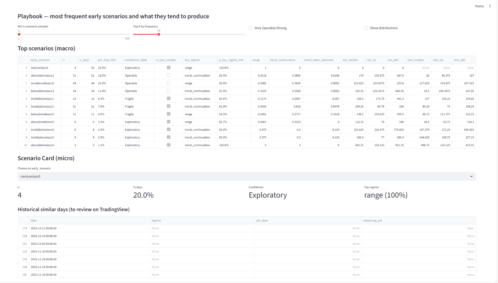

# Intraday Market Regime Monitor

A decision-support and monitoring framework that classifies intraday market conditions
based on early price behavior relative to session reference levels.

The objective is to reduce cognitive bias and improve expectation-setting
(continuation vs range vs mean reversion), not to generate automated trading signals.

---

## What this is
- A structured framework to classify early intraday market scenarios
  (e.g. inside / above / below reference levels)
- A historical decision table with conditional probabilities and distributions for:
  - trend continuation
  - mean reversion
  - range-like behavior
- A lightweight dashboard to explore scenarios, drill down into similar historical days,
  and support discretionary decision-making

## What this is not
- Not an automated trading system
- Not an execution engine
- Not a signal generator
- Not a guarantee of performance or profitability

---

## Dashboard (current prototype)

### Overview

### Live Assist

### Playbook

---

## How it works (high level)
1. Build session reference levels from a fixed historical window
2. Observe early price positioning and acceptance vs rejection
   during pre-market and the first 15–30 minutes after the open
3. Classify the observed state into an early scenario label
4. Aggregate historical outcomes by scenario
5. Use decision tables and distributions to calibrate expectations
   and define invalidation criteria

---

## Tech stack
- Python (pandas, numpy)
- Streamlit (dashboard)
- Parquet datasets

---

## Status
Work in progress.

The current focus is on clarity, reproducibility,
and robust evaluation (exploratory vs evaluation phases),
rather than visual polish or production deployment.
