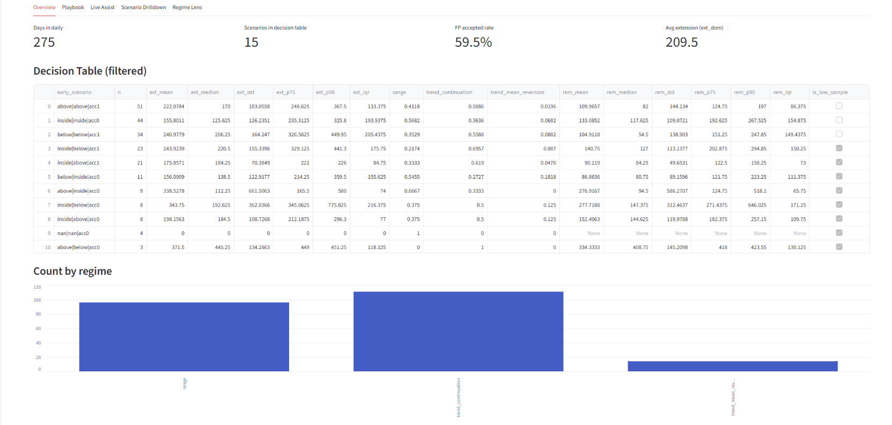
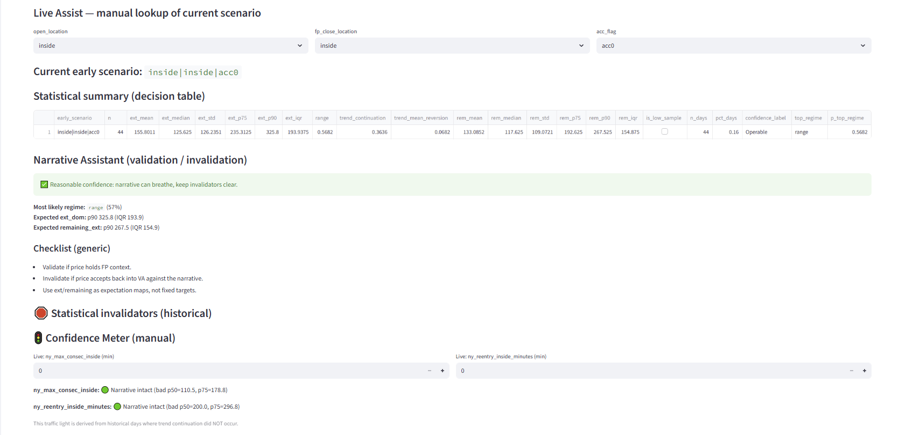

# Intraday Market Regime Monitor

A decision-support and monitoring framework that classifies intraday market conditions based on early price behavior relative to session reference levels.  
The goal is to reduce bias and improve expectation-setting (continuation vs range vs mean reversion), not to generate automated trading signals.

## What this is
- A structured way to classify “early scenarios” (e.g., inside/above/below reference levels) during pre-market and the first 15–30 minutes after the open
- A historical decision table with conditional probabilities and distributions for:
  - continuation vs mean reversion vs range-like behavior
  - expected extension and typical retracement behavior
- A lightweight dashboard to explore scenarios, drill down into similar historical days, and support discretionary decision-making

## What this is not
- Not an automated trading system
- Not an execution engine
- Not a guarantee of performance or profitability

## Dashboard (current prototype)
Screenshots:

## How it works (high level)
1. Build session reference levels from a fixed time window
2. Observe early price positioning and “acceptance vs rejection” in key windows (pre-market, first 15–30m after open)
3. Map the observed state into an early scenario label
4. Aggregate historical outcomes by scenario to produce decision tables and distributions
5. Use the dashboard to review expectations, confidence, invalidators, and similar historical days

## Tech stack
- Python (pandas / numpy)
- Streamlit (dashboard)
- Parquet datasets

## Status
Work in progress — focusing on clarity, reproducibility, and robust evaluation (exploratory vs evaluation phases).
